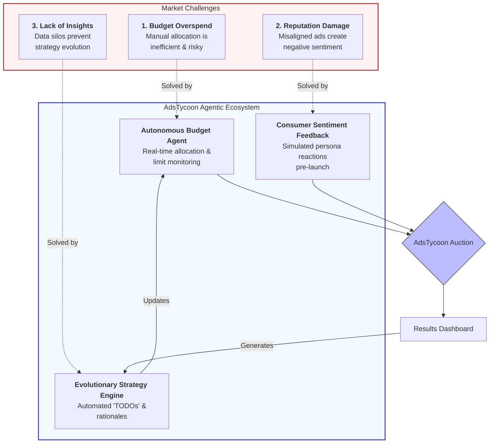
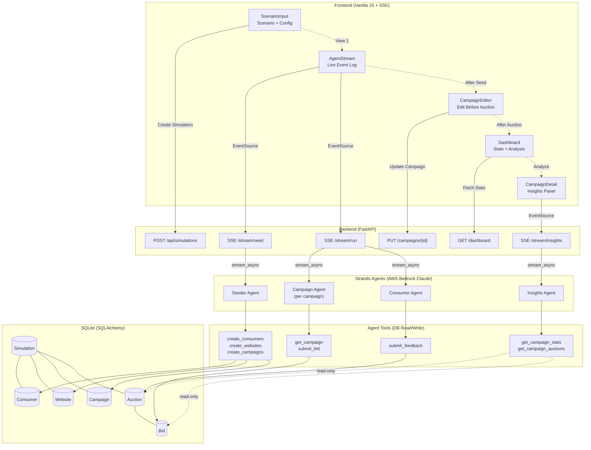
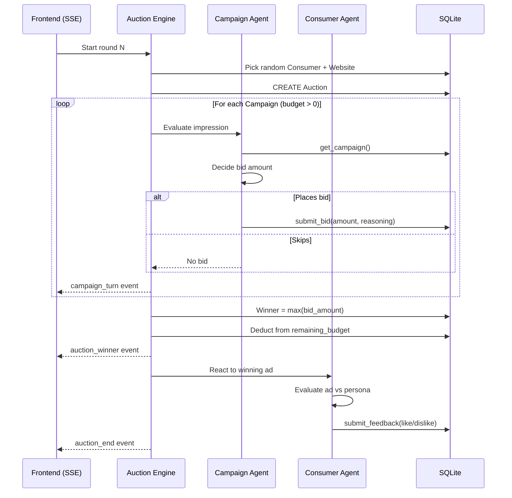

# AdsTycoon

> AdsGency AI Hackathon 2026 — Track 3: Autonomous Marketing Simulation

**[Video Demo](https://www.youtube.com/watch?v=SknZg78uOBA)**

A simulated real-time ad auction where AI consumer agents, website contexts, and campaign agents interact in a bidding loop. FastAPI acts as the exchange.

---

## Solution 



---

## Architecture



## Auction Loop (Per Round)



---

## Core Flow

```
Consumer visits page → Ad slot opens → Campaigns bid → Winner shown → Consumer reacts
```

One auction cycle:
1. Pick a random **consumer** (with persona)
2. Pick a random **website context** (page + placement)
3. Invoke multiple **campaign agents** to bid on the impression
4. Select winner (highest bid)
5. Invoke **consumer feedback agent** (like/dislike)
6. Store results, generate **campaign insights**

---

## Database Tables (SQLite via SQLAlchemy)

### `simulations` (parent — groups everything)
| Column | Type | Notes |
|--------|------|-------|
| id | UUID PK | |
| scenario | str | the user's scenario prompt |
| status | str | "seeded" / "running" / "completed" |
| created_at | datetime | |

### `consumers`
| Column | Type | Notes |
|--------|------|-------|
| id | UUID PK | |
| simulation_id | FK → simulations | |
| name | str | |
| age | int | |
| gender | str | |
| income_level | str | low/medium/high |
| interests | JSON | ["sports", "tech", ...] |
| intent | str | "browsing" / "researching" / "ready to buy" |
| location | str | |

### `websites`
| Column | Type | Notes |
|--------|------|-------|
| id | UUID PK | |
| simulation_id | FK → simulations | |
| name | str | "TechCrunch", "ESPN" |
| page_context | str | "article about running shoes" |
| ad_placement | str | banner / sidebar / interstitial |
| category | str | sports / tech / finance / ... |

### `campaigns`
| Column | Type | Notes |
|--------|------|-------|
| id | UUID PK | |
| simulation_id | FK → simulations | |
| campaign_name | str | |
| product_description | str | the creative/copy |
| goal | str | "reach" or "quality" |
| total_budget | float | starting budget |
| remaining_budget | float | decremented on wins |

### `auctions`
| Column | Type | Notes |
|--------|------|-------|
| id | UUID PK | |
| simulation_id | FK → simulations | |
| consumer_id | FK → consumers | |
| website_id | FK → websites | |
| winning_campaign_id | FK → campaigns | nullable if no bids |
| winning_bid | float | |
| consumer_feedback | str | "like" / "dislike" / null |
| created_at | datetime | |

### `bids`
| Column | Type | Notes |
|--------|------|-------|
| id | UUID PK | |
| auction_id | FK → auctions | |
| campaign_id | FK → campaigns | |
| bid_amount | float | |
| reasoning | str | LLM explanation of bid decision |

---

## API Endpoints

All endpoints prefixed with `/api`.

### Simulations
| Method | Path | Description |
|--------|------|-------------|
| POST | `/api/simulations` | Create + seed a new simulation (AI generates dataset from scenario prompt) |
| GET | `/api/simulations` | List all simulations |
| GET | `/api/simulations/{sim_id}` | Simulation detail (scenario, status, counts) |
| POST | `/api/simulations/{sim_id}/run` | Run N auction rounds (default 1) |
| POST | `/api/simulations/{sim_id}/reset` | Clear auctions/bids, reset campaign budgets |

### Auctions (scoped to simulation)
| Method | Path | Description |
|--------|------|-------------|
| GET | `/api/simulations/{sim_id}/auctions` | List auctions (newest first) |
| GET | `/api/simulations/{sim_id}/auctions/{id}` | Auction detail with all bids, winner, feedback |

### Campaigns (scoped to simulation)
| Method | Path | Description |
|--------|------|-------------|
| GET | `/api/simulations/{sim_id}/campaigns` | List campaigns with remaining budget |
| GET | `/api/simulations/{sim_id}/campaigns/{id}` | Campaign detail + win/loss/feedback stats |
| GET | `/api/simulations/{sim_id}/campaigns/{id}/insights` | AI-generated insights + suggestions |

### Dashboard (scoped to simulation)
| Method | Path | Description |
|--------|------|-------------|
| GET | `/api/simulations/{sim_id}/dashboard` | Stats: total auctions, avg bid, like/dislike ratio, budget burn |

---

## Simulation Dataflow

### Stage 0 — Seeding (AI-generated dataset)

```
POST /api/simulations
{
  "scenario": "Compare reach vs quality bidding strategies for sports brands targeting young males",
  "num_consumers": 20,
  "num_websites": 10,
  "num_campaigns": 4
}
```

The **Seeding Agent** interprets the scenario and generates:
- **Diverse consumers** — varied demographics, not all matching target (realistic noise)
- **Relevant + irrelevant websites** — mix of on-topic and off-topic contexts
- **Campaigns with different strategies** — as scenario dictates

### Stages 1–5 — Auction Pipeline

One call to `POST /api/simulations/{sim_id}/run` executes this pipeline N times:

```
POST /api/simulations/{sim_id}/run?rounds=5
  │
  │  ╔═══════════════════════════════════════╗
  │  ║  REPEAT for each round               ║
  │  ╠═══════════════════════════════════════╣
  │  ║                                       ║
  │  ║  1. Pick random consumer + website    ║
  │  ║     → BidRequest {consumer, website}  ║
  │  ║                                       ║
  │  ║  2. For each campaign (budget > 0)    ║
  │  ║     → Campaign Agent (parallel)       ║
  │  ║     → {bid_amount, reasoning} or skip ║
  │  ║                                       ║
  │  ║  3. Highest bid wins                  ║
  │  ║     → Deduct from remaining_budget    ║
  │  ║                                       ║
  │  ║  4. Consumer Feedback Agent           ║
  │  ║     → "like" or "dislike"             ║
  │  ║                                       ║
  │  ║  5. Save auction + bids to DB         ║
  │  ║                                       ║
  │  ╚═══════════════════════════════════════╝
  │
  └─► Return: [AuctionResult, ...]
```

### Stage 6 — Insights (on-demand)

Called via `GET /api/simulations/{sim_id}/campaigns/{id}/insights`. Aggregates auction history and generates AI-powered suggestions.

---

## Agents (Strands Agents SDK + Claude)

Each agent is a Strands Agent with **tool-use** — the LLM decides when and how to call tools to read/write the database.

### 1. Seeding Agent

Takes a simulation objective and generates all assets against the DB schema.

- **Input**: scenario prompt + counts (`num_consumers`, `num_websites`, `num_campaigns`)
- **Output**: populated `consumers`, `websites`, `campaigns` tables
- **Strands Tools**:
  - `create_consumers(simulation_id, consumers: list)` — batch insert consumers
  - `create_websites(simulation_id, websites: list)` — batch insert websites
  - `create_campaigns(simulation_id, campaigns: list)` — batch insert campaigns

The agent interprets the scenario to generate diverse, realistic data — including off-target consumers and irrelevant websites for noise.

### 2. Campaign Agent

Responsible for issuing a bid on behalf of a single campaign for a given impression.

- **Input**: consumer profile + website context + campaign details (budget, goal, product)
- **Output**: `{ bid_amount, reasoning }` or skip (no bid)
- **Strands Tools**:
  - `get_campaign(campaign_id)` — read campaign details + remaining budget
  - `submit_bid(auction_id, campaign_id, bid_amount, reasoning)` — place a bid

**Behavior by goal**:
- `reach` → bid on most impressions, bid low to stretch budget
- `quality` → bid selectively on high-relevance impressions, bid higher

### 3. Consumer Feedback Agent

Acts from the consumer's viewpoint to generate feedback on the winning ad.

- **Input**: consumer persona + website context + winning ad creative
- **Output**: `{ feedback: "like" | "dislike", reasoning }`
- **Strands Tools**:
  - `submit_feedback(auction_id, feedback, reasoning)` — record consumer reaction

The agent role-plays as the consumer, considering their demographics, interests, and intent to decide if the ad resonates.

### 4. Insights Agent (on-demand)

Analyzes campaign performance and generates AI-powered suggestions.

- **Input**: campaign + full auction history
- **Output**: `{ summary, suggestions[] }`
- **Strands Tools**:
  - `get_campaign_auctions(campaign_id)` — fetch all auctions for a campaign
  - `get_campaign_stats(campaign_id)` — win rate, avg bid, like/dislike ratio

---

## Project Structure

```
adsgency/
├── backend/
│   ├── main.py              # FastAPI app, CORS, startup
│   ├── database.py           # SQLAlchemy engine, session, Base
│   ├── models.py             # ORM models (6 tables)
│   ├── schemas.py            # Pydantic request/response schemas
│   ├── routers/
│   │   ├── simulations.py    # POST /api/simulations, GET list/detail, /run, /reset
│   │   ├── auctions.py       # GET /api/simulations/{sim_id}/auctions
│   │   ├── campaigns.py      # GET /api/simulations/{sim_id}/campaigns, /insights
│   │   └── dashboard.py      # GET /api/simulations/{sim_id}/dashboard
│   ├── agents/
│   │   ├── seeder.py         # Seeding agent (generates dataset from scenario)
│   │   ├── campaign.py       # Campaign bidding agent
│   │   ├── consumer.py       # Consumer feedback agent
│   │   └── insights.py       # Campaign insights agent
│   ├── tools/
│   │   ├── seeder_tools.py   # create_consumers, create_websites, create_campaigns
│   │   ├── campaign_tools.py # get_campaign, submit_bid
│   │   ├── consumer_tools.py # submit_feedback
│   │   └── insights_tools.py # get_campaign_auctions, get_campaign_stats
│   └── requirements.txt
├── frontend/                  # React (later)
└── .env                       # ANTHROPIC_API_KEY
```

---

## Tech Stack

- **FastAPI** — async, fast, good for hackathon
- **SQLite + SQLAlchemy** — zero setup DB
- **Strands Agents SDK** (`strands-agents[anthropic]`) — agent framework with native Claude support
- **Anthropic Claude** — LLM provider via `AnthropicModel` from Strands
- **asyncio.gather** — run campaign agents in parallel

---

## Implementation Order

1. `database.py`, `models.py`, `schemas.py` — DB (6 tables) + Pydantic models
2. `agents/seeder.py` + `POST /api/simulations` — AI-driven dataset generation
3. `agents/campaign.py` + `agents/consumer.py` — bidding + feedback agents
4. `routers/simulations.py` — `/run` pipeline + `/reset` + list/detail
5. `routers/auctions.py` — read-only auction history
6. `routers/campaigns.py` + `agents/insights.py` — campaign stats + AI insights
7. `routers/dashboard.py` — per-simulation stats
8. `main.py` — wire everything together
